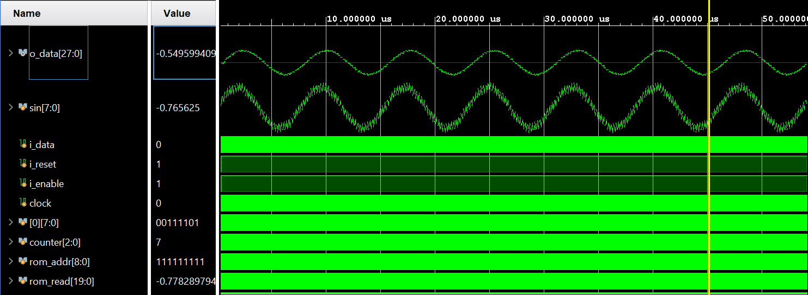

# DA FIR Filter

## Description
This project implements a Distributed Arithmetic (DA) FIR filter using Verilog. It includes modules for ROM-based FIR filtering and a testbench for verification.

<div style="text-align: center;">
  
  <p><em>Figure 1: DA FIR filter architecture.</em></p>
</div>

<div style="text-align: center;">
  
  <p><em>Figure 2: Compressed DA FIR filter architecture.</em></p>
</div>

## Directory Structure
```
da_fir_filter/
├── mem_files/       # Memory initialization files
├── modules/         # Verilog modules for DA FIR filter
├── testbench/       # Testbench for simulation
```

## Key Files
- **Modules**:
  - `da_rom_fir_filter.v`: Implements a ROM-based FIR filter.
  - `symm_da_rom_fir.v`  : Optimized FIR filter exploiting coefficient symmetry using a remapping interface table.
- **Testbenches**:
  - `tb_da_fir.v`        : Testbench for the DA FIR filter.
  - `tb_i_noisy_sine.txt`: Input data for testing.

## How to Use
1. **Simulation**:
   - Use a Verilog simulator (e.g., Vivado) to simulate the testbench.
   - Adjust Radix and Waveform according to format.
2. **Synthesis**:
   - Use a synthesis tool (e.g., Vivado) to synthesize the design.


<div style="text-align: center;">
  
  <p><em>Figure 3: Testbench results for DA FIR filter.</em></p>
</div>

<div style="text-align: center;">
  
  <p><em>Figure 4: Testbench results for Optimized DA FIR filter.</em></p>
</div>