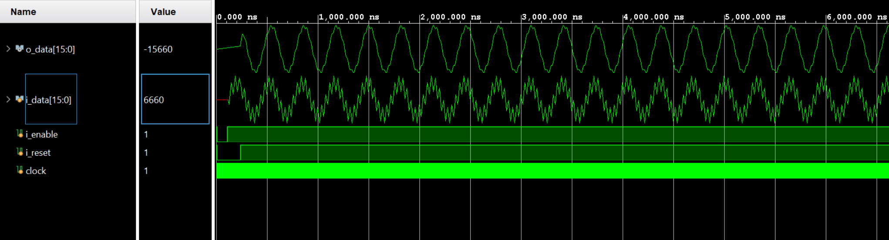

# IIR Filter

## Description
This project implements an IIR filter using Verilog. It includes modules for coefficient assignment and Saturation, Rounding and Truncation.

## Directory Structure
```
iir_filter/
├── modules/         # Verilog modules for IIR filter
├── testbench/       # Testbench for simulation
```

## Key Files
- **Modules**:
  - `iir_filter.v`       : Implements an IIR filter.
  - `iir_coeffs.v`       : Coefficients assignment.
  - `Sat_Round_Trunc.v  `: Implements a Saturation or Rounding and Truncation with adjustable sizes
- **Testbenches**:
  - `tb_da_fir.v`        : Testbench for the IIR filter.
  - `tb_i_noisy_sine.txt`: Input data for testing.

## How to Use
1. **Simulation**:
   - Use a Verilog simulator (e.g., Vivado) to simulate the testbench.
   - Adjust Radix and Waveform according to format.
2. **Synthesis**:
   - Use a synthesis tool (e.g., Vivado) to synthesize the design.

<div style="text-align: center;">
  
  <p><em>Figure 1: Testbench results for IIR filter.</em></p>
</div>
