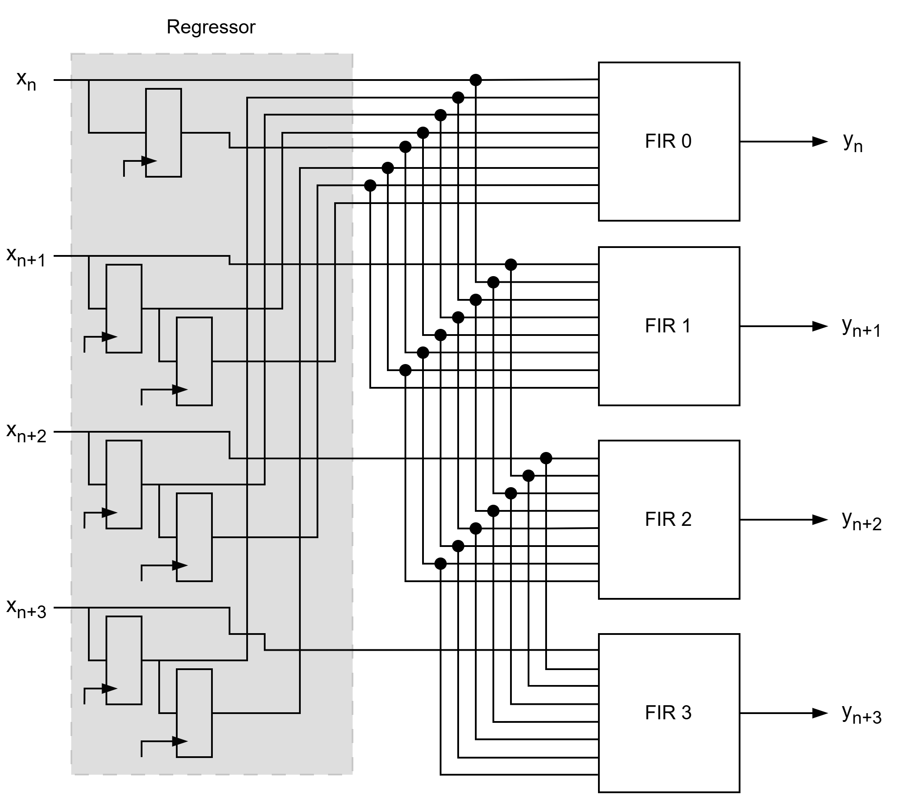
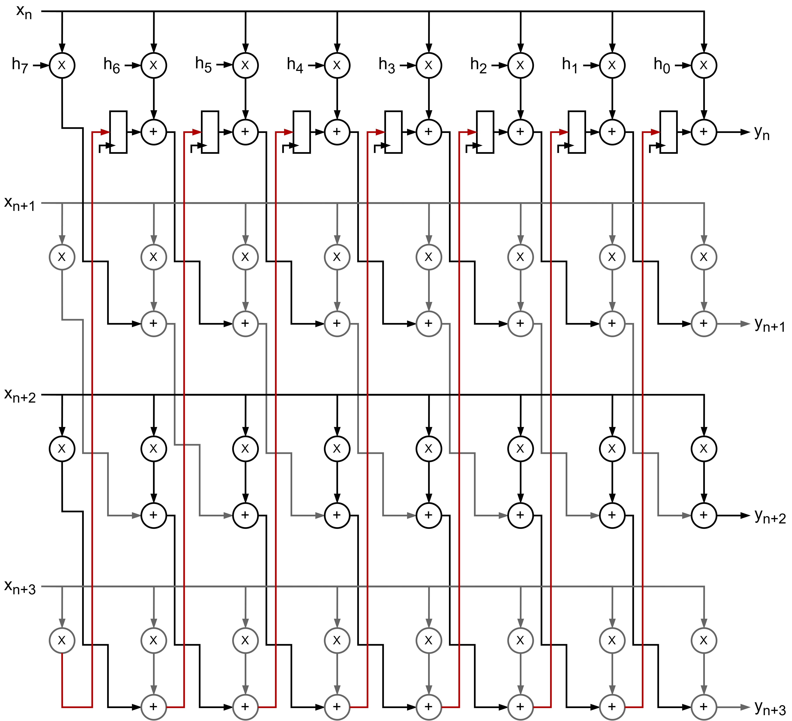
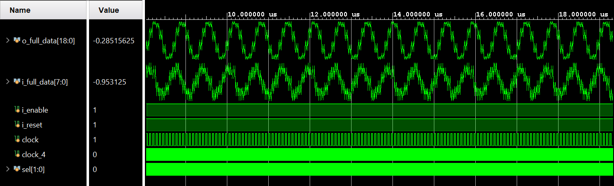
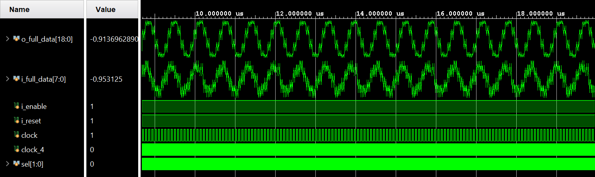

# Optimized FIR filter

## Description
This project implements two optimized variants of a FIR filter using Verilog. It includes modules for a Parallel Direct FIR filter, an Unfolded Transposed FIR filter, a TOP file and a testbench for verification.

<div style="text-align: center;">
  
  <p><em>Figure 1: Parallel FIR Filter Diagram.</em></p>
</div>

<div style="text-align: center;">
  
  <p><em>Figure 2: Unfolded FIR Filter Diagram.</em></p>
</div>

## Directory Structure
```
opt_fir_filter/
├── include/         # Coefficients assignment and .xdc files
├── modules/         # Verilog modules for OPT FIR filter
├── testbench/       # Testbench for simulation
```

## Key Files
- **Include**:
  - `Arty_Master.xdc`    : Constraints file for Implementation.
  - `fir_coeffs.v`       : Coefficients assignment.
- **Modules**:
  - `fir_filter.v`       : Implements a FIR filter - type architecture without input registers.
  - `parallel_fir.v`     : Optimized FIR filter using a level 4 Parellism. It uses the module `fir_filter.v`.
  - `unfolded_fir.v`     : Optimized FIR filter using a level 4 Unfolding.
  - `signal_generator.v` : Generates a signal for testing.
  - `top_opt_fir.v`      : Allows choosing between the two optimized versions and includes the signal generator.
- **Testbenches**:
  - `tb_opt_fir.v`       : Testbench for the Optimized FIR filter. 
  - `tb_i_noisy_sine.txt`: Input data for testing.

## How to Use
1. **Simulation**:
   - Use a Verilog simulator (e.g., Vivado) to simulate the testbench.
   - Adjust Radix and Waveform according to format.
2. **Synthesis**:
   - Use a synthesis tool (e.g., Vivado) to synthesize the design.

<div style="text-align: center;">
  
  <p><em>Figure 3: Testbench results for Parallel FIR filter.</em></p>
</div>

<div style="text-align: center;">
  
  <p><em>Figure 2: Testbench results for Unfolded FIR filter.</em></p>
</div>
