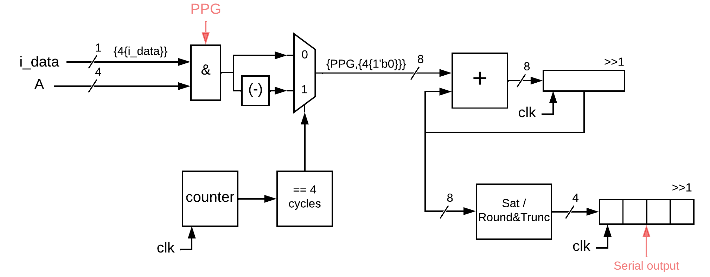

# Sequential Multiplier

## Description
This project implements a Sequential Multiplier using Verilog. It includes a module for Saturation, Rounding and Truncation.

<div style="text-align: center;">
  
  <p><em>Figure 1: Sequential Multiplier Diagram.</em></p>
</div>

## Directory Structure
```
seq_mult/
├── modules/         # Verilog modules for Sequential Multiplier
├── testbench/       # Testbench for simulation
```

## Key Files
- **Modules**:
  - `seq_mult.v`         : Implements a Sequential Multiplier
  - `Sat_Round_Trunc.v  `: Implements a Saturation or Rounding and Truncation with adjustable sizes
- **Testbenches**:
  - `tb_da_fir.v`        : Testbench for the Sequential Multiplier.

## How to Use
1. **Simulation**:
   - Use a Verilog simulator (e.g., Vivado) to simulate the testbench.
   - Adjust Radix and Waveform according to format.
2. **Synthesis**:
   - Use a synthesis tool (e.g., Vivado) to synthesize the design.