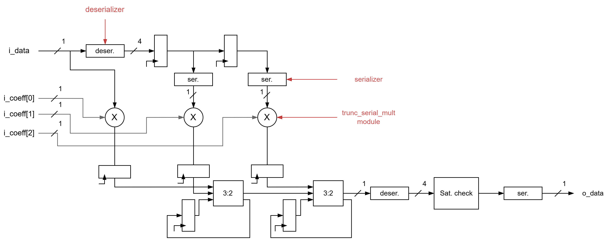

# Serial FIR filter

## Description
This project implements a Serial FIR filter using Verilog. It includes modules for serial filtering and serial multiplication.

<div style="text-align: center;">
  
  <p><em>Figure 1: Serial FIR filter architecture.</em></p>
</div>

## Directory Structure
```
serial_fir/
├── modules/         # Verilog modules for Serial FIR filter
├── testbench/       # Testbench for simulation
```

## Key Files
- **Modules**:
  - `serial_fir.v`           : Implements a Serial FIR filter.
  - `trunc_serial_mult.v`    : Implements a Bit - Serial Signed Multiplier with a truncated output.
- **Testbenches**:
  - `tb_serial_fir_filter.v` : Testbench for the Serial FIR filter.
  - `tb_i_noisy_sine.txt`    : Input data for testing.

## How to Use
1. **Simulation**:
   - Use a Verilog simulator (e.g., Vivado) to simulate the testbench.
   - Adjust Radix and Waveform according to format.
2. **Synthesis**:
   - Use a synthesis tool (e.g., Vivado) to synthesize the design.