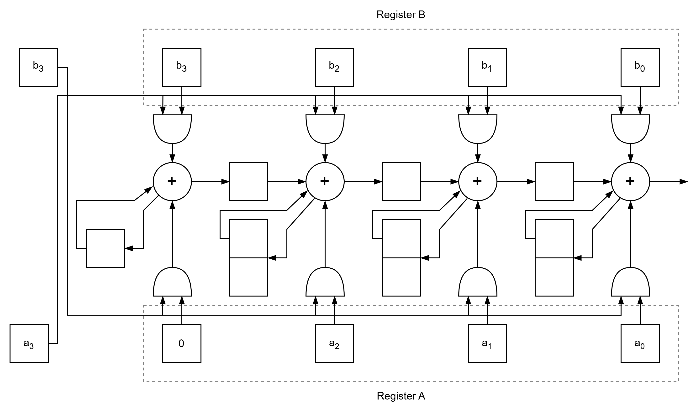

# Optimized FIR filter

## Description
This project implements three versions of a Serial Multiplier using Verilog. It includes modules for an Unsigned Multiplier, a Signed Multiplier, a Truncated Signed Multiplier and a testbench for verification.

<div style="text-align: center;">
  
  <p><em>Figure 1: Unsigned Serial Multiplier.</em></p>
</div>

<div style="text-align: center;">
  
  <p><em>Figure 2: Signed Serial Multiplier.</em></p>
</div>

<div style="text-align: center;">
  
  <p><em>Figure 3: Truncated Signed Serial Multiplier.</em></p>
</div>

## Directory Structure
```
serial_mult/
├── modules/         # Verilog modules for Serial Multiplier
├── testbench/       # Testbench for simulation
```

## Key Files
- **Modules**:
  - `serial_mult.v`       : Implements a Bit - Serial Unsigned Multiplier.
  - `sig_serial_mult.v`   : Implements a Bit - Serial Signed Multiplier.
  - `trunc_serial_mult.v` : Implements a Bit - Serial Signed Multiplier with a truncated output.
- **Testbenches**:
  - `tb_serial_mult.v`    : Testbench for the Serial Multipliers. 

## How to Use
1. **Simulation**:
   - Use a Verilog simulator (e.g., Vivado) to simulate the testbench.
   - Adjust Radix and Waveform according to format.
2. **Synthesis**:
   - Use a synthesis tool (e.g., Vivado) to synthesize the design.